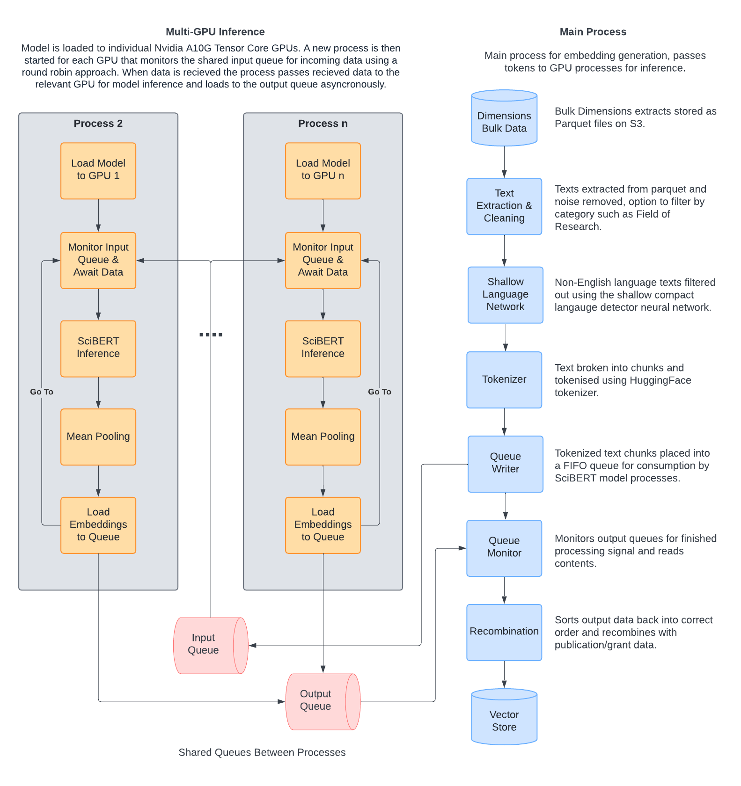

# Publication Embedding Pipeline
Pipeline for extracting sentence embeddings from publication/grant abstracts and titles on S3.

## Pre-requisites

#### Nvidia CUDA
On linux systems such as our Ubuntu EC2s, PyTorch requires CUDA Toolkit 11.8 and associated CUDA drivers >= 520.61.05 and CUDA libraries >= 11.8.0.
If this is not installed on your machine by default you can find instructions on how to install these requirements in the [DS Handbook](https://fictional-waddle-d23967af.pages.github.io/docs/Environments/cuda_setup/).

On Macs with Apple silicon CUDA is not required as these systems use Metal which is supported by PyTorch and automatically detected and used instead of CUDA by the embedding pipeline.

#### Compact Language Detector v3 Requirements
If using Compact Language Detector v3 for language filtering Google Protocol Buffers need to be installed.
These are platform neutral buffers for serializing structured data developed by Google for use in their products.


These can be installed on the Ubuntu OS used on our AWS EC2 instances using:
```bash
sudo apt install -y protobuf-compiler
```

## Publication Embedding Pipeline
#### Data Format
The `embed.py` file is designed to produce embeddings from Dimensions bulk parquet Publication and Grant files.
Data must be stored on S3 with parquet files stored in folders by publication or grant year:
```
|-- 2001 -- parquet_1.parquet
|        -- parquet_2.parquet
|        -- parquet_3.parquet
|
|-- 2002 -- parquet_1.parquet
         -- parquet_2.parquet
```
Embeddings are generated using the concatenated title and abstracts.

#### CLI Tool
Basic command to read parquet files S3, generate embeddings and output results to parquet on S3.

Parquet input and output directories need to be set using `--input` or `-i` and `--output` or `-o`.
The years between which to extract data also needs to be set.
```bash
python embed.py 'path/to/input/uri' 'path/to/output/uri' 2022 2023
```
To run inference in parallel over all available GPUs use `--parallelise` or for simplicity `-p`:
```bash
python embed.py 'path/to/input/uri' 'path/to/output/uri' 2022 2023 -p
```
The default Hugging Face tokenizer and model is allenai/scibert_scivocab_uncased.
To specify a different tokenizer from the Hugging Face model store with `--tokenizer` or just `t` and a different model using `--model` or `m`.
For example to run inference in parallel with custom tokenizer and model:
```bash
python embed.py 'path/to/input/uri' 'path/to/output/uri' 2022 2023 -p -t 'elastic/multilingual-e5-small' -m 'elastic/multilingual-e5-small'
```
#### Python Library
The dimension embedding pipeline can also be called and run in Python, as shown below:
```python
from embed import AbstractEmbeddings

abstract_embeddings = AbstractEmbeddings()

abstract_embeddings.infer_embeddings(
    'path/to/input/uri',
    'path/to/output/uri',
    2022,
    2023,
    parallelise=True
)
```
## Inference Class
The Dimensions embedding pipeline above relies on the inherited `EmbeddingModel` class from the `inference.py` module. This can also be used as a stand-alone module in Python for inference of any data over both a single GPU or distributed over multiple GPUs. With inference on any tokenizer or model available on the Hugging Face model store.

Example usage for multi-GPU inference:
```python
import pandas as pd
from inference import EmbeddingModel

data = pd.read_csv('data/path.csv')

# Initialise model to use multiple GPUs.
embedding_model = EmbeddingModel(
    tokenizer_name='elastic/multilingual-e5-small',
    model_name='elastic/multilingual-e5-small',
    parallelise=True
)

# If using multiple GPUs launch local process for each GPU.
embedding_model.launch_processes()

embeddings = embedding_model.run_inference(data['text'].tolist(), batch_size=100)

# If using multiple GPUs kill spawned processes.
embedding_model.kill_processes()
```
Example usage for single GPU inference:
```python
import pandas as pd
from inference import EmbeddingModel

data = pd.read_csv('data/path.csv')

# Initialise model to use multiple GPUs.
embedding_model = EmbeddingModel(
    tokenizer_name='elastic/multilingual-e5-small',
    model_name='elastic/multilingual-e5-small',
    parallelise=False
)

embeddings = embedding_model.run_inference(data['text'].tolist(), batch_size=100)
```
## Embedding Pipeline Overview
Oveview of complete end-to-end embedding process using multiple GPUs.



## Text Cleaning
Documents with empty title or abstract strings are removed and titles and abstracts are concatenated, texts with a word length of less than 20 are then dropped.

## Compact Language Detector v3
Compact Language Detector v3 (CLD3) is a pre-trained shallow neural network developed by Google for language identification in the Chrome browser, we use a Python port of the original C++ library. The model has a single hidden ReLU layer followed by a softmax output layer, that infers language probabilities from an dense input vector calculated using a concatenated embedding of average n-gram occurances.

As SciBERT, PubMedBERT and other relevant models are not multi-lingual and only support only English language, CLD3 is used in the embedding pipeline to filter out non-English language text. CLD3 is configured to examine the first 1000 bytes of the abstract, filtering out texts where the highest softmax score is not en (English).

For more details on CLD3 and the languages it supports see the [Google CLD3 GitHub documentation](https://github.com/google/cld3).

## Text Model Inference
The vectorization class allows the use of most Hugging Face Sentence Transformer models, however the Allen AI SciBERT transformer model (allenai/scibert_scivocab_uncased) is used by default.

Model inference steps:
1. Data is tokenized using the models accompanying tokenizer from Hugging Face.
2. Tokens are batched to a size that will fit inside the GPU memory left after loading the model to the GPU.
3. Inference is performed by a forward pass of each batch through the sentence transformer model.
4. The model outputs are then mean pooled by taking the element-wise arithmetic mean of the token level embeddings.
5. These pooled embeddings are then appended together and returned.

Model tokenization and inference is performed by the `EmbeddingModel` class in `inference.py`.

## Data Parallel Multi-GPU Inference
The pipeline can be optionally use multiple GPUs for faster inference of large amounts of data. However at time of development Hugging Face does not have a native way to perform data parallel type inference of text transformer models, their documentaiton simply says "coming soon". Therefore to process data at scale we needed to develop our own parallel processing pipeline.

Pipeline overview:
1. The pipeline detects the available GPUs.
2. A copy of the model being used is written to the memory of each GPU, the GPUs being used must have enough memory to hold a full copy of the model and allow a reasonable amount of data to be copied to the GPU for inference. If using AWS EC2 G5 instances are recommended for most models as they use Nvidia A10 Tensor Core GPUs which have 24GB of DDR memory.
3. A process is then started for each availalbe GPU, these processes actively monitor a shared input FIFO queue for incoming data using a round robin approach.
4. The main process then reads in each parquet files, then tokenises and batches text from each parquet file into chunks of a size that will fit into the free GPU memory left after loading the model (pipeline default batch size is 512). This data is then passed to each process via the shared input queue, along with a number indicating their original order, allowing order preservation of output embeddings as these can be returned asynchronously from the GPU processes.
5. Once the GPU processes recieve the batched tokens from the input queue, they run model inference and pooling, write the embeddings to a shared output FIFO queue, then return to monitoring the input queue.
6. The main process monitors the output queue and once the number of embedding data chunks returned equal the number of batches originally placed in the input queue, re-assembles these into the correct order and writes these to S3 as a single parquet file.
7. Once all parquet files have been processed, the GPU inference processes are killed by passing a semaphore to each process via the shared input queue and the memory on each GPU is cleared.

Note on errors: The pipeline has an error exception for KeyboardInterrupt errors that kills all active processes, allowing clean killing of all processes using ctrl-c. However other errors are currently not caught, meaning it is possible that most or all of the GPU processes will continue running if the main process crashes and may need to be manually killed.